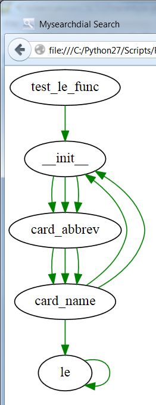
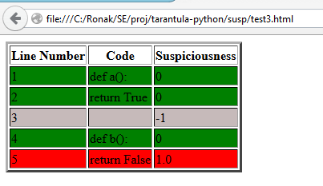

# Tarantula in Python      

CSC 510- Software Engineering  
Project Report 1b

#Goals

 Our goal in this project is to create a code coverage tool that can help developers with unit testing. We want to make a tool like Tarantula ( a fault localization tool that is designed and available for Ruby) in Python.  
 
 * Our system will help python developers do the following:  
      - Locate the most likely lines which caused any of the unit tests to fail using our python implementation of Tarantula.
      - And point out lines of code which were not covered during the unit test 

#Background

  * As a software product expands and becomes more complex with the addition of features and functionality, the chances of bugs and defects being introduced in the software increases. This poses a problem to the development and QA team to know how many lines of code are being covered by their unit tests and where certain failures are occuring, so as to prevent bug escapes which bring down the quality of the product.
  * The former problem can be resolved by Code Coverage while the latter one by Fault Localization.

## *Problem 1: How much of my code is actally tested ? Use Code Coverage.       
<b>What is Code Coverage?  </b>

The Wikipedia definition[4] of code coverage is "In computer science, code coverage is a measure used to describe the degree to which the source code of a program is tested by a particular test suite. A program with high code coverage has been more thoroughly tested and has a lower chance of containing software bugs than a program with low code coverage."  

Finding out the coverage that a test suite/test case gives is very beneficial for a developer; she can find out which functions have not been tested, what conditions have not been tested very easily.  

Code coverage can be of varying granularity for eg. Function coverage, Statement coverage, Branch coverage and Condition coverage  
  - Function coverage: Has each function been covered ?  
  - Statement coverage: Has each statement been covered ?  
  - Branch coverage: Has each branch been covered (eg. if and else block) ?  
  - Condition coverage: Has each condition in a conditional block been tested (eg. in if a==5 or b == 6, both conditions for a as well as b should be tested)?  
 The complexity becomes higher from the start to the end of the above list. Most of the tools we refered are based on Branch coverage (with the exception of Coverage.py which also has a branch coverage mode).  

In our project, we are using coverage.py and figleaf.py, two Python libraries for code coverage.  

## *Problem 2: What caused my test cases to fail ? Use Fault Localization.  

  <b>What is fault localization?</b>

  Fault localization is a process to find the location of faults. It determines the root cause of the failure. It identifies the causes of abnormal behaviour of a faulty program. It identifies exactly where the bugs are. (This definition has been taken from the paper "Fault Localization for Java Programs Using Probabilistic Program Dependence Graph" [1] ) 

  Tarantula is a tool developed in Ruby which performs fault localization. 

  * Developers need to know where certain unit tests fail in an efficient way and what pieces of the code are not being covered by the existing unit tests.  
    

####<b>Related Work</b>    
The closest tool to what we our doing is Tarantula.[1]   
Other related work in this field includes the work of Max Planck Institute, Bug-Assist, which is an error localization tool for ANSI-C[6]. Hawk-eye is another similar tool for Java and uses the Tarantula formula alongwith Ochiai formula to calculate suspiciousness of each statement[7].

#Methods  

<b>How to find who is the culprit?</b>

Tarantula calculates the "suspiciousness" of a line based on the formula : 

suspiciousness(e) = (failed(e)/total failed) / ((passed(e)/total passed)+(failed(e)/total failed))  

where 'e' denotes the line being checked. 

The suspiciousness value is a value between 0 and 1 for those lines that have been executed and -1 for those that have not.  
Suspiciousness values and their meanings:  
 -1 : The line was not executed and hence is not the cause for failure of the test case.  
 0 : The line was executed but it is not the cause of the test failure.  
 1 : This line is the most likely cause for the test to fail.  
 
 A higher value denotes a higher probability of that line being the cause of failure for the test case.  

The formula for suspiciousness varies from technique to technique; the formula we have used is just one of the possibilities.

Our "two techniques":  

The two methods that we have implemented are :  
 - coverage.py
 - figleaf.py
 
These two are code coverage libraries in Python. We used each library and executed it on test cases. Using the result from these, we calculated the suspiciousness of each line. The color-coded suspiciousness value of each line can be seen from the html file "pyh.html". The line is red when the suspiciousness value is 1, that is, the probability of that line causing the test case to fail is 1. The line is green when the suspiciousness value is 0, that is, the probability of that line causing the test case to fail is 0. The line is grey when the suspiciousness value is -1, that is, that line has not been covered by any test case, or that line is not executable.   

#Our Approach and Testing Procedure

We pick up test files from the 'test' folder. Coverage/Figleaf is run on every test case in every file and their results collected. From the results of these, suspiciousness values are calculated for every source file in the 'src' folder. The lines of every source file (with line number) and the suspiciousness value of each line is displayed via HTML (pyh.html).  The results of coverage can be seen in the 'newhtmlcov' folder (index.html). We also create a code Graph via the library trace.py so that the developer can see the route their unit tests are taking to see if they are going down the right path. An example of this code graph can be seen below. 

This has been done for some sample test files that we created and also for one test file 'test_card.py' from a project 'pydealer' form github.  

For our system to run, we have made several assumptions and modified the test cases to cater to our assumptions. Our assumptions are:
 * All the source files are under the 'src' folder.  
 * All the test files are under the 'test' folder.   
 * Each test case returns a value 0 if successful and 1 if an assertion error is thrown.  
 * Every source file in the 'src' folder is part of the project as every source file in this folder is analyzed.  

Since the 'pydealer' project did not have these things, we had to modify the test file so that it would be compatible with our system.  

We imported the os and sys module and added the path of the src folder to the system path so it could look for the source files in the 'src' folder.  Because of Python versioning issues, instead of assertX methods we had to use assert keyword. Also, every test case returns a value of 0 it if passes and 1 if it fails. This is required to find how how many test cases have passed and failed for suspiciousness calculation.  

We have learnt in class that testing all possible inputs to a system is not possible. We have tested some sample data that we have created and also tested on one test file from a live github project. We have tested as much as we could, given the assumptions and requirements of our system.  

#Results

After the successful execution of our tool, we can see the files that have been touched by test cases; which lines have been covered and which lines have not been covered. This is visible in an HTML page (newcovhtml/index.html). We can also see the suspiciousness of each file in another HTML page. (pyh.html).Below is a screen shot of the HTML page produced

 

From the table shown below you can see that on the same test case environment it takes figleaf half the time to execute than while using coverage. This could be in part due to coverage touching files deeper down the stack than figleaf does which can be seen in the html files located in the repo under 'FinalTestRuns/Coverage/PyDealer/susp' and 'FinalTestRuns/figleaf/PyDealer/susp', where card is the only source file shown as having code covered in figleaf while coverage covers more of the source files in PyDealer. 

| Trials              | Figleaf     | Coverage    |
|--------------------:|-------------|-------------|
| 1                   | 2.315999985 | 5.129513025 |
| 2                   | 2.351999998 | 5.151515007 |
| 3                   | 2.414000034 | 5.328532934 |
| 4                   | 2.315999985 | 5.106999874 |
| 5                   | 2.327000141 | 5.096999884 |
| 6                   | 2.318000078 | 5.107000113 |
| 7                   | 2.335999966 | 5.11500001  |
| 8                   | 2.325000048 | 5.089999914 |
| 9                   | 2.34800005  | 5.104000092 |
| Average Time in Sec | 2.339111143 | 5.136617872 |  

Seeing that Coverage.py touches more lines of code through a deeper stack would be great for a developer who is performing an integration test of their code inside a larger system. But if they just want to quickly run through the functionality of their class or module figleaf would be the better choice. 

#Discussion
 
In the  implementation of both these techniques, the most important difference is in the versions of Python. Figleaf.py operates only on Python2 whereas Coverage.py works on Python2 and Python3. 

We have seen that the coverage.py library is much better documented than figleaf.  

An important function, clear() is not visible outside the library in figleaf, which made figleaf a lot more problematic to implement than coverage.py. Because of this, we are unable to execute our figleaf script as a Python program; we have to run figleaf on the script file too. This made the task of extracting the results of figleaf a very tedious one. 

coverage.py script execution:   
<code>python automated_coverage</code>

figleaf script execution:   
<code>figleaf automated_figleaf</code>

We had to spend a lot more effort and time on figleaf than on coverage.py. 

Figleaf does not allow us to get coverage values of individual files, that is, there is no analyis(filename) method which returns coverage statistics for that file. AN indirect approach had to be taken for this-gatherFiles() had to be used instead which data of all the files that have been touched.  

#Conclusion

As per our evaluations regarding the run times, we can see that Figleaf was faster and hence can be of great use in places where the codebase is huge or when you have a time constraint to finish the testing.  

On the other hand, coverage.py gives an exhaustive analysis of the files. It is ideal for cases where the testing is very important for example in mission critical systems.  

#Future Work

A project is never truly 'complete'. There is always a feature that can be added or a small tweak that can make the code more efficient. Our project follows this too. One possible improvement can be to get rid of the assumptions, that is, the folder structure can be dynamic and can be taken as an input from the developer. To find out whether a test case has failed or not without having to return a 0 or 1 explicitly. The front end can be improved too; at the moment we have implemented a very basic UI.  

Another possible improvement can be to integrate the output of coverage and fault localization so that the developer can see in one place which lines have not been covered and which line caused a test case to fail.  

One thing that we felt a desperate need was for good figleaf APIs. When you compare it to what coverage.py has, the APIs of figleaf seem very less cleanly defined and they certainly lack some methods for easier data access. This could be a good addition to the existing set of APIs.    

#References  

[1] http://spideruci.org/papers/jones05.pdf "Empirical Evaluation of the Tarantula Automatic Fault-Localization Technique", by James A. Jones and Mary Jean Harrold  

[2] http://nedbatchelder.com/code/coverage/  

[3] http://darcs.idyll.org/~t/projects/figleaf/doc/  

[4] http://en.wikipedia.org/wiki/Code_coverage  

[5] http://arxiv.org/ftp/arxiv/papers/1201/1201.3985.pdf  "Fault Localization for Java Programs Using Probabilistic Program
Dependence Graph" by A.Askarunisa, T. Manju and B. Giri Babu  

[6] http://bugassist.mpi-sws.org/

[7] https://code.google.com/p/hawk-eye/  

[8] https://github.com/prove/tarantula
